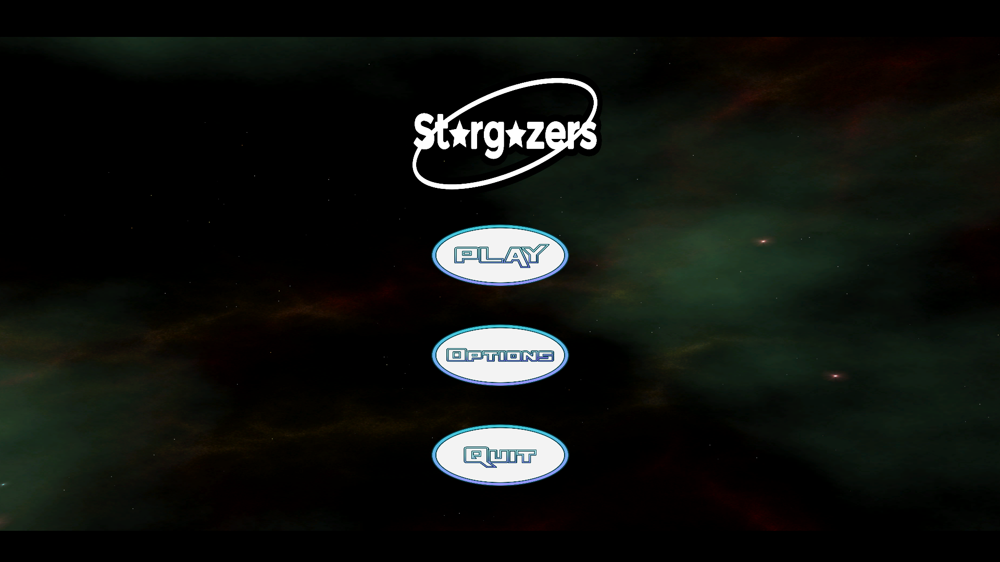
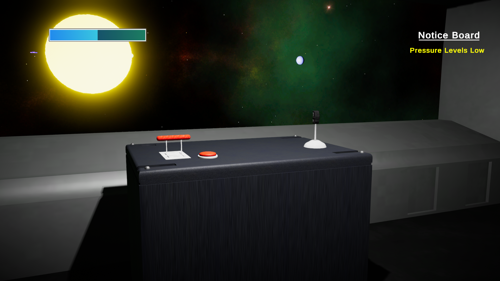

# Stargazers

### Game Description

Stargazers is a first-person adventure game where players will control their spaceship 
to travel to multiple planets. Players will need to run around inside the ship completing 
various tasks such as cooling the engines and adding fuel to maintain the ship. As they
travel to each planet, they will uncover the mysteries of the solar system.

### Screenshots

### Demo Video

[https://youtu.be/2EXuPXy7kRQ](https://youtu.be/2EXuPXy7kRQ "Youtube")

### Developement Team

Atlas X Games
Ame Gilham - 100741352
Jackie Zhou - 100750922
Ryan Sukhu - 100600038
Alvin Ng - 100754129
(Only In Social and Multiplayer Game Design) Jeffrey Lundy - 100745949

### Third-Party acknowledgement

The only 3rd party assets used are the following free assets from the Unity Asset Store:
Joystick Pack (Used to create touchscreen joystick controls for mobile verisons of the game)
and LeanTween (Used to animate the UI)

Some code was reused from the engine in classes tutorial content in particular, the tutorials covering object pooling, event queue, and DLLs

Additionally the following video was referenced while coding some of the features:
Floating Origin (Singleton and Observer): https://youtu.be/jLi9oo413js
